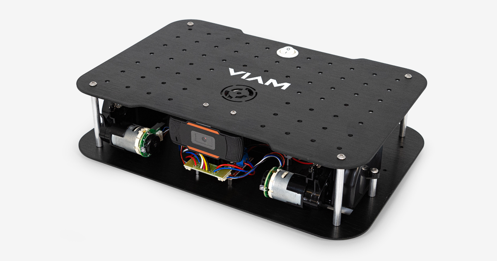

<h1 align="center">ALPHA VIAM ROVER</h1>

<em>bot bashing odyssey — ROS 2 Humble</em>

Testing and proving a new way to build robots: “bot bashing” — vibe-coding a robot by pairing a high-level AI planner with an on-device coding agent.

## Quick Links
- Roadmap: `alpha_viam_rover_roadmap_v1.0.md`
- Agents: `AGENTS.md` (root) and subsystem guides
- Backlog: `docs/ISSUE_BACKLOG.md`
- Teleop & Viz: `docs/tools/teleop.md` and `configs/foxglove/default_layout.json`

## Project Clarity
- Started with an out‑of‑box Viam Rover v2 kit; additional parts were on‑hand.
- Compute is a Raspberry Pi 4B for now (may upgrade later).
- Viam’s chassis carrier board schematic isn’t published; I manually traced the pinout.
- Wheel encoders are not fully sorted yet — work in progress.

## What Is This?
I’ve been building robots since the Basic Stamp 2 days. Robotics is my passion, but the barrier to entry can be steep — especially on the software side. You need to wrangle Linux, networking, Git, and the whole robotics stack.

For this project, I’m experimenting with a workflow where I use GPT‑5‑Pro to generate an end‑to‑end robotics architecture based on my exact hardware configuration, and then a local Codex CLI agent (running GPT‑5‑thinking‑high) on the robot implements the plan. In short: I’m vibe coding a robot. I call it “bot bashing,” and I think it’s the future.

On‑device Codex CLI benefits (why local):
- System maintenance: automate updates, manage services, inspect logs, and keep the stack healthy.
- Rapid diagnostics: trace processes, check ROS 2 topics/TF, run targeted tests, and suggest fixes.
- New hardware integration: quickly scaffold drivers/configs/URDF/launch for sensors, cameras, and more.

## Agents & Roles
- GPT‑5‑Pro — Architect: designs the end‑to‑end robotics architecture, drafts the roadmap, and proposes interfaces, milestones, and safety gates.
- Codex CLI — On‑device implementer/maintainer: runs on the rover to implement the plan, maintain services, perform diagnostics, and integrate new hardware locally.
- Codex IDE — Repo orchestration (this agent): bootstraps and maintains the repository, documentation, and automation. Work so far:
  - Initialized the Git repo, configured SSH, and pushed the project to GitHub.
  - Rewrote and structured `README.md`; added hero image and “Project Clock” auto‑updater workflow.
  - Scaffolded repo per roadmap: `docs/`, `configs/`, `urdf/`, `launch/`, `hw/`, `scripts/`, `calibration/`, `bags/` (placeholders).
  - Added the AGENTS chain: `AGENTS.md` (root) + subsystem `AGENTS.md` files; created `AGENTS_PROGRESS.md`.
  - Added governance: `.github/CODEOWNERS`, PR/Issue templates, and `REPO_UPDATES.md`.
  - Renamed roadmap to `alpha_viam_rover_roadmap_v1.0.md` for proper GitHub rendering; added `CONTRIBUTING.md`.

## Hardware
- Chassis: Viam Rover v2
  - Resource page: https://www.viam.com/resources/rover
  - Reference repo: https://github.com/viamrobotics/Viam-Rover-2

## Future Build Plans (Short)
- Finalize encoder wiring and odometry via `ros2_control`.
- Integrate IMU, INA219 power sensing, and YDLIDAR G4.
- Teleop + visualization with Foxglove; MCAP logging.
- Mapping and basic navigation with SLAM Toolbox and Nav2.
- See [alpha_viam_rover_roadmap_v1.0.md](alpha_viam_rover_roadmap_v1.0.md) for the living plan.

## Repo Contents
- [alpha_viam_rover_roadmap_v1.0.md](alpha_viam_rover_roadmap_v1.0.md) — The current high-level roadmap that guides implementation.
- `README.md` — You’re here. Context, links, and how to follow along.
- Images and assets for the project log.
 - `AGENTS.md` — Agent operating guide (root) with links to sub-guides.
 - `AGENTS_PROGRESS.md` — Append-only log for work evidence.
 - `REPO_UPDATES.md` — Planning, progress, CI, and releases policy.

More will arrive as the build progresses (modules, configs, scripts, notes).

## Bot Bashing Framework (Coming Soon)
I’m formalizing “bot bashing” as a dedicated, open framework with clear roles, permissions, safety gates, escalation protocols, backup policies, and operational conventions. Once fully defined and tested, it will live in its own repo with docs, templates, and examples.

## Follow Along
- Build updates and commentary on X: @alpha_rover — https://x.com/Alpha10six
- Issues will track milestones and blockers; PRs will show diff-based progress.

## Getting Started (Observers)
If you’re following along or want to try something similar:
- Read the roadmap: [alpha_viam_rover_roadmap_v1.0.md](alpha_viam_rover_roadmap_v1.0.md) to see the current plan.
- Watch issues and PRs for day-to-day progress.
- If you have a Viam Rover v2, explore the links above to get your hardware ready.

## Contributing
Please read `CONTRIBUTING.md` before opening a PR. Highlights:
- Use short-lived branches and Conventional Commits.
- Include evidence (short MCAP, Foxglove layout/screenshot) for sensor/control/nav changes.
- Update docs/configs and append to `AGENTS_PROGRESS.md` after merge.
- High-impact changes require architect approval (`needs-architect`), enforced by CODEOWNERS.

References: `AGENTS.md`, `REPO_UPDATES.md`.

## License
TBD (will be added once the public scope is finalized).

## Security
See `SECURITY.md` for private disclosure and operational guidance.
